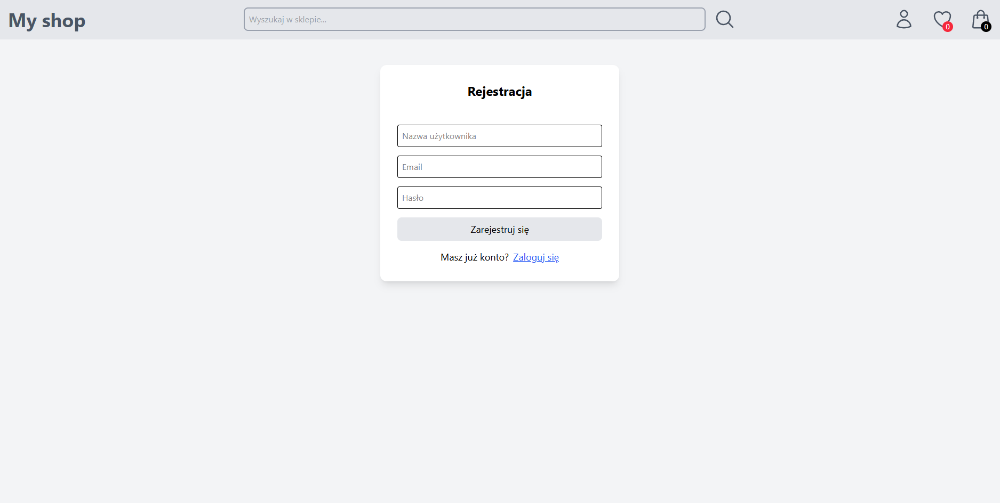

# 🖥️ E-Commerce Web App – Computer Accessories Store

A responsive **e-commerce web application** focused on computer accessories. This app includes the essential features of a real online shop — from browsing and filtering products to managing favorites and a shopping cart.

---

## 🚀 Features

### 🔐 **User Authentication**

-   Users can **register** and **log in** securely using **Firebase Authentication**.
-   Session handling allows users to stay logged in across visits.

### 🧭 **Navigation**

-   A **navbar** includes:
    -   Link to the **homepage**
    -   **Search bar** for finding products
    -   **Profile icon** for login/logout
    -   **Heart icon** to access favorite items
    -   **Cart icon** to view items in the cart

### 🛍️ **Homepage**

-   Displays **products filtered** by:
    -   **Category**
    -   **Brand**
    -   **Price range**
-   Users can easily browse, filter, and discover relevant products.

### 💖 **Favorites Page**

-   View and manage your **favorite items**.
-   Add or remove products from your favorites list with a single click.
-   Favorites are stored in **Firestore** for persistent access.

### 🛒 **Shopping Cart Page**

-   See all items added to the **shopping cart**.
-   Modify quantities or remove items directly.
-   Cart data is saved in **Firestore** and tied to the user’s account.

### 📄 **Product Details Page**

-   View detailed product information.
-   **Add item to cart** directly from the product page.
-   See a list of **similar products** based on the selected item.

---

## 🛠️ Technologies Used

-   ⚛️ **React**
-   📜 **JavaScript (ES6+)**
-   🎨 **CSS / Tailwind CSS**
-   🔥 **Firebase**:
    -   **Authentication** (for user login/register)
    -   **Firestore** (for storing user data like cart/favorites)

---
# https://shopmyy.netlify.app #

## **Screenshots**

